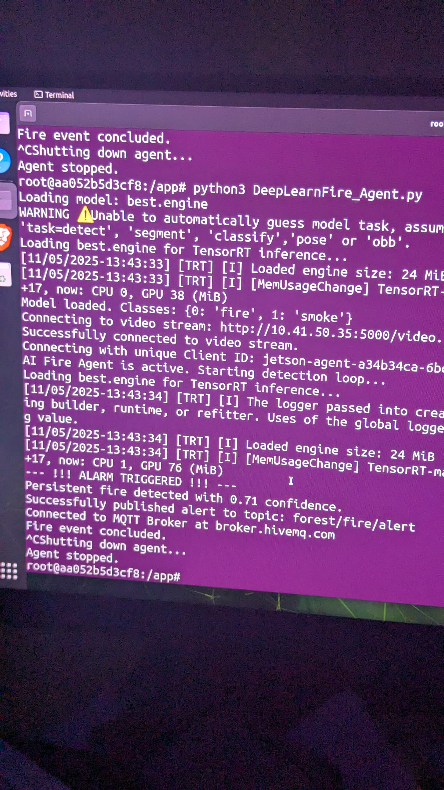
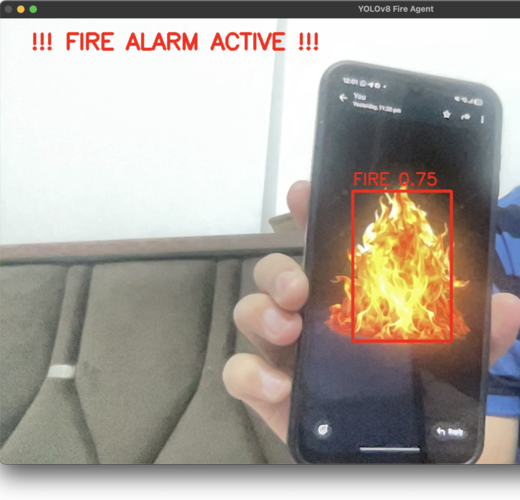
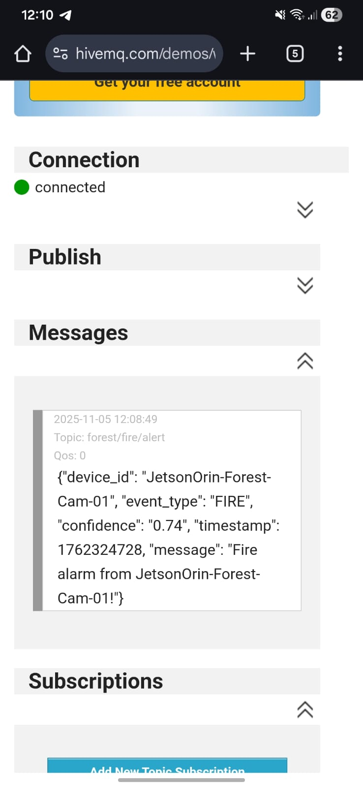

# ECHS
# Autonomous AI Agent for Forest Fire Detection (ECHS Project)

This repository contains the complete progression of the Forest Fire Detection project, from initial research (TA1) to a final deployed AI agent (End Sem).

* **TA1:** Fire detection using traditional Computer Vision (Color Masking & Wavelet Analysis).
* **TA2:** Training a Deep Learning (YOLOv8) model for superior accuracy.
* **End Sem:** Deploying the YOLOv8 model as an autonomous, high-performance AI agent on an NVIDIA Jetson Orin Nano, complete with real-time MQTT alerts.

### Screenshots & Results

* **Terminal Screen**   

   <p align="center">
     
   </p>

* **Detection Dashboard**
    <p align="center">
     
   </p>

* **Mqtt (Agent) Alert:**
    <p align="center">
     
   </p>

---

## Part 1: TA1 - Traditional CV (Wavelet Energy)

This first attempt used "classic" (non-AI) computer vision techniques to identify fire. The method relies on two principles: fire is reddish-orange, and fire "flickers" at a high frequency.

* **Methodology:**
    1.  **Color Masking:** The script converts each video frame to the HSV (Hue, Saturation, Value) color space. It creates a mask that only keeps pixels within the reddish-orange color range.
    2.  **Wavelet Transform:** This mask is applied to the frame. A Discrete Wavelet Transform (`pywt.dwt2`) is used to analyze the texture. Fire's rapid, chaotic flickering has a very high "wavelet energy".
    3.  **Detection:** If the calculated energy is above a set threshold, the system flags it as a fire.

* **Limitations:** This method is extremely prone to false positives. Sunsets, red-colored vehicles, and even bright sunlight can trigger the color mask and produce high energy, leading to false alarms.


---

## Part 2: TA2 - Deep Learning (YOLOv8 Detection)
The limitations of the traditional approach led to a deep learning solution. A YOLOv8 (You Only Look Once) model was trained to recognize the visual patterns and context of fire and smoke, not just their color.

### 2.1. Dataset

The model was trained on the "Fire and Smoke Detection" dataset from Roboflow.

Link: https://universe.roboflow.com/fire-dataset-tp9jt/fire-detection-sejra

Classes: fire, smoke

Preprocessing: We generated a new version of the dataset on Roboflow with a 70% (Train), 20% (Valid), 10% (Test) split, which is required for training an accurate model.

### 2.2. Model Training

The model was trained in the cloud using Google Colab to leverage its free T4 GPU.

Model Choice: We chose YOLOv8s (small). It provides a massive accuracy boost over YOLOv8n (nano) while remaining small and fast enough for an edge device.

Notebook: The full training process is in the Forest_fire_jetson.ipynb file.

#### Procedure:

Installed roboflow and ultralytics.

Downloaded the dataset (version 1) from Roboflow.

Trained the yolov8s.pt model for 50 epochs.

Result: This process created the best.pt file, a trained PyTorch model with an mAP50 of 0.592.

### 2.3. Simple Detector Code

This script (Laptop_version.py) is a simple demo of the trained model. It loads the best.pt file and runs detection on a local video file, drawing bounding boxes on the screen.

--- 

## Part 3: End Sem Project - Autonomous AI Agent
This is the final, complete system. It solves the complex deployment challenges and converts the simple detector into a "headless" autonomous agent that sends real-time alerts.

### 3.1. Working Procedure (On Jetson Orin Nano)

Step 1: (Prerequisite) Set up a Video Stream

To run the Jetson "headless," we need a video source. This cam_server.py script can be run on a laptop to stream its webcam over the network. The Jetson will connect to this stream.

On Laptop:

Find your laptop's IP address (e.g., 192.168.1.12).

Run this script:
```python 
from flask import Flask, Response
import cv2

app = Flask(__name__)
camera = cv2.VideoCapture(0)  # Use default laptop webcam
camera.set(cv2.CAP_PROP_FRAME_WIDTH, 640)
camera.set(cv2.CAP_PROP_FRAME_HEIGHT, 480)

def generate_frames():
    while True:
        success, frame = camera.read()
        if not success:
            break
        else:
            ret, buffer = cv2.imencode('.jpg', frame)
            frame = buffer.tobytes()
            yield (b'--frame\r\n'
                   b'Content-Type: image/jpeg\r\n\r\n' + frame + b'\r\n')

@app.route('/video')
def video():
    return Response(generate_frames(), mimetype='multipart/x-mixed-replace; boundary=frame')

if __name__ == "__main__":
    # Host on 0.0.0.0 so it's accessible over the network
    app.run(host="0.0.0.0", port=5000)
```

### Step 2: (On Jetson) Create a Swapfile

The Jetson Orin Nano's 8GB of RAM is not enough to convert the model. We must create an 8GB swapfile on the SSD to act as virtual RAM.

```bash
sudo fallocate -l 8G /var/swapfile
sudo chmod 600 /var/swapfile
sudo mkswap /var/swapfile
sudo swapon /var/swapfile

```

### Step 3: (On Jetson) Run the Docker Container

This is the most important step. It solves all PyTorch/CUDA dependency problems.

```bash
# Set the container name
t=ultralytics/ultralytics:latest-jetson-jetpack6

# Set your project path (e.g., /home/viresh/Desktop/forest_fire/)
PROJECT_PATH="<path_to_your_project_folder>"

# Run the container, linking your project folder to /app
# We run this "headless" (no camera --device flag)
sudo docker run -it --ipc=host --runtime=nvidia \
  -v $PROJECT_PATH:/app \
  $t
  ``` 
### Step 4: (Inside Container) Optimize Model to TensorRT

You are now inside the container. Convert your .pt file to a high-speed .engine file.

```bash 
# 1. Go to your project folder
cd /app

# 2. Run the export. This will fail if you didn't create the swapfile.
#    We use 'half=True' for FP16 optimization, which is ideal for Jetson.
yolo export model=best.pt format=engine half=True

```
This creates best.engine in your folder.

### Step 5: (Inside Container) Run the Final Agent

Install MQTT:
```bash 
pip install paho-mqtt
```
Edit the Agent Code:

The container has no GUI, so we must install nano:
```bash
apt-get update && apt-get install -y nano
```
Open the script: nano DeepLearnFire_Agent.py

Make sure MODEL_PATH = 'best.engine'.

Make sure VIDEO_SOURCE = "http://<YOUR_LAPTOP_IP>:5000/video".

Crucially: Comment out all cv2.imshow(), cv2.waitKey(), and cv2.destroyAllWindows() lines. The script must be headless to run in Docker.

Run the Agent:
```bash 
python3 DeepLearnFire_Agent.py
```
The agent is now running. It will print "Successfully connected..." and "AI Fire Agent is active...". You can view the alerts by subscribing to the forest/fire/alert topic on any MQTT client (like the HiveMQ Web Client).

--- 
### --- 👨‍💻 Authors ---

- **Viresh Kamlapure**
- **Sahil Chouhan**
- **Yash Kulkarni**
- **Gaurav Gadekar**

### -----------------
